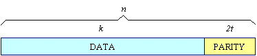
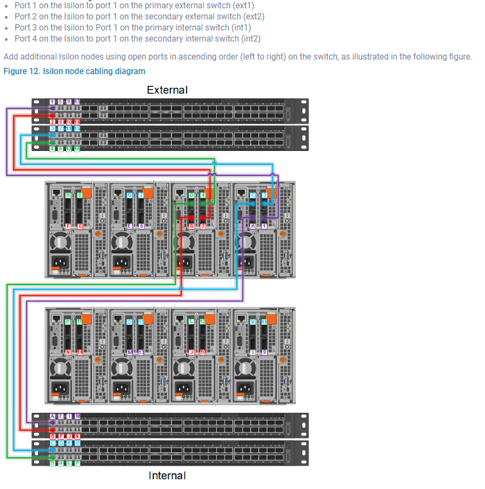

# Notional PowerScale Architecture

I made this to build out a notional architecture for a PowerScale setup. Customer requires a solution which can do the following:

- Collect PCAP data at 25Gb/s
- Assuming 24/7 continuous storage, it must be able to store the PCAP for 30 days
- Should provide all networking, cabling, and sever equipment.
- Choice of PCAP collection software is left up to the vendor.
- The solution should provide a way to look up an arbitrary 5-tuple across the entire PCAP dataset and return a result within 5 seconds.

## Decision Making Process for PowerScale

I began by identifying which chassis options would likely be most effective for the given scenario. To do this I started with the Isilon Gen 6 Cheat Sheet:

In our notional architecture we need $25*60^2*24*31/8=8,370,000$GBs of storage or 8.37PB. Our major bottleneck is going to be storage space. For our solution we will use [Google Stenographer](https://github.com/google/stenographer) to capture the traffic.

The first thing we have to consider is how much space we'll actually need to effectively store 8.37PB. In the interest of being a bit more investigative, I decided to research how Reed-Solomon, the algorithm by which we store data, actually works.

### Calculating Total Space Required

[Isilon Sizing: Sizing for Accurate Capacity by Bhupendra Singh](https://education.dellemc.com/content/dam/dell-emc/documents/en-us/2020KS_Singh-Isilon_Sizing_Sizing_For_Capacity.pdf)

#### Understanding Reed-Solomon Error Correction

[CMU Reed-Solomon Codes](https://www.cs.cmu.edu/~guyb/realworld/reedsolomon/reed_solomon_codes.html)

I took this article and adapted the sections I found confusing to clarify the explanation.

Reed-Solomon is represented with the notation `RS(n,k)`. This includes `s-bit` symbols which I'll explain in a moment. Collectively this means that the Reed-Solomon (RS) encoder takes *k* data symbols (whatever the user wants to store), each of length *s* and adds some number of parity symbols which collectively create an *n* symbol codeword. There are $n-k$ parity symbols, each with length *s* which allow us to correct for up to *t* symbols that contain errors in a codeword where $2t=n-k$.

Image from [CMU Reed-Solomon Codes](https://www.cs.cmu.edu/~guyb/realworld/reedsolomon/reed_solomon_codes.html)

**Example**

A popular Reed-Solomon code is RS(255,223) with 8-bit (one byte) symbols. Said another way, it is 255 1 byte symbols (the total size of the codeword) and 223 1 byte symbols of that are data symbols (the actual payload). Of the total, 223 bytes are data and 32 bytes are parity. This breaks down into:
$n = 255, k=223, s=8, 2t=32, t=16$
This means that the decoder can correct up to 16 bytes (16 symbols) of errors anywhere in our 223 bytes of data without issue.

**Symbol Error**: A symbol error occurs if any number of bits in a single symbol (in our example, a data byte) are wrong. It doesn't matter how many bits are wrong; it could be one or all of them.

**Decoding**
Reed-Solomon algebraic decoding procedures can correct errors and erasures. An erasure occurs when the position of an erred symbol is known. A decoder can correct up to t errors or up to 2t erasures.

##### What is an [Erasure](https://en.wikipedia.org/wiki/Erasure_code)?

In coding theory, an erasure code is a forward error correction (FEC) code under the assumption of bit erasures (rather than bit errors), which transforms a message of k (remember that's our data) symbols into a longer message (code word) with n symbols such that the original message can be recovered from a subset of the n symbols. The fraction $r = \frac{k}{n}$ is called the *code rate*. The fraction $\frac{k'}{k}$, where *k’* denotes the number of symbols required for recovery, is called *reception efficiency*.

**The part that wasn't clear to me**
The particular scheme in use is unknown - erasure coding is a general concept. Like an RFC, there are mathematical principals to which it must adhere, in this case it must obey the rules set out by RS, but there isn't a specific defined method.

When a codeword is decoded, there are three possible outcomes:

1. If $2s + r < 2t$ (s errors, r erasures) then the original transmitted code word will always be recovered
2. If it isn't recovered, the decoder will detect that it cannot recover the original code word and indicate this fact OR
3. The decoder will mis-decode and recover an incorrect code word without any indication.

The probability of each of the three possibilities depends on the particular Reed-Solomon code and on the number and distribution of errors.

##### My Simple Mathematic Intuition of a Reed Solomon Encoder/Decoder

Based on [this lecture](https://web.eecs.utk.edu/~mbeck/classes/cs560/560/notes/Erasure/2004-ICL.pdf). They used colorized diagrams with the matrix math implied by a multiplication of the colors whereas I reinterpreted that as a formal matrix equation.

Using linear algebra, a simple Reed Solomon code follows the canonical pattern $Ax=b$. Assume you have *n* data words $d_1,...,d_n$ and *m* coding words $c_1,...,c_m$. Encoding and decoding will use an *n+m* by *n* coding matrix *B*.

Let *B* some matrix such that $B<d_1,\dots, d_n>=<d_1,\dots,d_n,c_1,\dots,c_m>$ where the first *n* rows of *B* will form the identity matrix. It doesn't have to actually be the identity matrix, the matrix *B* simply must adhere to the property that deleteing any *m* rows result in an invertible matrix for the math to work out in the next part. It's worth saying that when we delete *m* rows the resulting matrix will be square which is a necessary condition to being invertible along with each of the columns being linearly independent (no one column is an integer multiple of another column). [My notes on invertibility and linear independence](#invertibility-and-linear-independence)

$\begin{bmatrix}\dots I_{nxn} \dots\\\dots RAND_{mxn} \dots \end{bmatrix}$

The resulting matrix is an *n+m* by *n* with the top part being some *nxn* matrix and the bottom part being an *mxn* matrix for the code word portion.

To decode, you would receive *n* words. By some method of your choosing (it doesn't actually matter what) you know what rows from *B* correspond to those *n* words. See page 14 of [the lecture](https://web.eecs.utk.edu/~mbeck/classes/cs560/560/notes/Erasure/2004-ICL.pdf) for a better graphic since I'm not doing the explanation much justice here for the sake of brevity. 

Then you form the equation $B'^{-1}Bx=B'^{-1}b$ where $B'$ is an invertible matrix created from the rows of *B* which correspond to the correct rows of *n* and *x* is the received data. The result is the original data. Various systems exist to make it so that the original matrix has properties which make it so that you would be able to reconstruct the original data if one piece were missing. A very naive way could be the sum of the elements of the original codewords in $n$. If you know in what word the failure occurred (an erasure) you could use the total value to recreate the missing element.

**Return to Sizing PowerScale**

Thanks to the above, we now understand what *N* and *M* are in the context of OneFS. Here they just directly correlate to drives. I'll assume that we set *N* and *M* to maximum for a stripe width of 20. PowerScale has a block size of 8KB so our minimum file size is 128KB. Less than that and our files are mirrored rather than employing erasure coding which we want to avoid. In our use case, we can control the size of the PCAP files written so this isn't a problem. Subsequently, we should be operating close to the theoretical max efficiency.

Using [the sizing tool](https://isilon-sizing-tool.herokuapp.com/legacy/apps/v3/) it comes up with a number of viable configurations. Based on a guess, I suspect the following configuration to be roughly the most cost effective.

It is worth noting for capacity planning that I assumed 100% utilization which is impossible. That said, in the given use case, in the many times I've heard it, never once has 100% utilization actually been reached. Subsequently, in the interest of being cost effective I am cutting it closer than would truly be possible. I also only protected it at 1n because customers in this particular scenario rarely want additional protection. The risk of losing PCAP is worth it when offset by the cost of the additional protection. Some even want no redundancy which isn't possible in the PowerScale. Between the cheat sheet and the sizing tool I settled on a solution employing 32 H5600s.

## Networking

Based on [our documentation](https://infohub.delltechnologies.com/l/configuration-best-practices-dell-emc-storage-with-milestone-xprotect-corporate/connecting-the-isilon-nodes-14), each node should be cabled in the following manner:

That means 2x connections for both the backend and frontend networks which means for a 32 node setup 64 total connections each on the backend and frontend networks. Following is the breakdown of the network equipment we would need:

- 4 Z9264s to cover both backend and frontend networks assuming the customer already has spine switches available. If not we would need to provide those as well.
  - If we needed to include spines we would also need the 100GbE uplink cables
- 130 MPO cables - 4 per node plus 2 for an R740 I'd put on the frontend to actually ingest the traffic.
- For this use case we could use either 10Gb/s or 25Gb/s receivers on the frontend - it depends on how the customer plans to ingest the traffic. We'll say that any node should be able to support a full PCAP load and act as the "captain" (as the technical documentation calls it) for full line rate. Subsequently we'd need 66 25Gb/s ethernet transceivers.
  - Depending on existing infrastructure, we would need an additional 33 ethernet transceivers for all of the management connections plus an additional 33 ethernet cables.

For the topology, it would largely depend on what the customer is doing. In the past I've typically ran L2 leaf-spine with VLT because most customers these days don't have much routing going on (or at least not the ones I've been sent to). That said, we could just as easily put in a L3 leaf-spine config with OSPF.

We would have at least three VLANs - one for the backend, one for the frontend, and one for management.

## Software Functionality

In our notional use case our software is [Google Stenographer](https://github.com/google/stenographer) but realistically it could be any capture program. The import piece to consider from a storage perspective is that this setup could potentially ingest up to 25Gb/s which the PowerScale would see all in one file stream. This means our "captain" box would actually see a single 25Gb/s write coming in. Our notional architecture will support this with the 25Gb/s hitting the frontend via whatever mount we choose (probably NFS) and then it would distribute it out to the supporting nodes as described in the technical guide.

 
 

## Invertibility and Linear Independence

